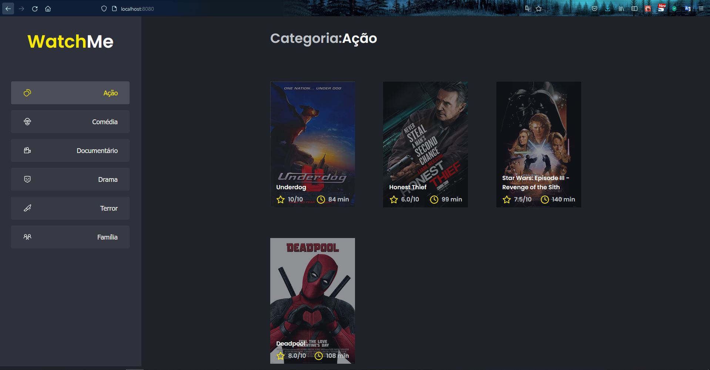
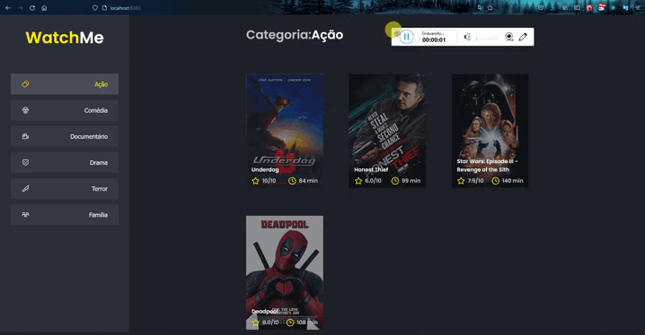

<h1 align="center">Ignite: Desafio 02 - Componentizando a aplicação</h1>

## :bookmark_tabs: Desafio

Utilizar o template disponibilizado e separar a aplicação em duas partes: sidebar, área que permite selecionar uma categoria, e content, com o header e a listagem dos filmes. 

## :sparkler: Aplicação

## Demonstração

